# CARE Analysis Report

**Code Archaeologist & Refactor Engine**

| Property | Value |
|----------|-------|
| **Project** | `/data/data/com.termux/files/home/PyGitUp` |
| **Analyzed** | 2026-02-01T17:46:13.673Z |
| **Duration** | 5.71s |
| **Files** | 41 |
| **Modules** | 82 |


---

## Executive Summary

This repository contains **41 files** across **82 modules**, 
totaling approximately **9,968 lines of code**.

### Key Metrics

| Metric | Count | Status |
|--------|-------|--------|
| Functions | 274 | - |
| Classes | 8 | - |
| God Functions | 99 | GOOD |
| Circular Dependencies | 0 | GOOD |
| Dead Code Items | 126 | GOOD |
| Hidden Couplings | 0 | GOOD |
| Average Complexity | 12.0 | GOOD |


---

## Health Score Card

### Overall Grade: **F** (0/100)

| Category | Score | Weight |
|----------|-------|--------|
| Code Quality | -197% | 25% |
| Architecture | 100% | 25% |
| Maintainability | -152% | 25% |
| Coupling | 100% | 25% |

### Technical Debt Estimate

**Estimated effort to address all issues:** 7.0 weeks

- God Functions: ~198h (refactoring)
- Circular Deps: ~0h (restructuring)
- Dead Code: ~63h (cleanup)
- Hidden Coupling: ~0h (documentation/refactoring)


---

## Architecture Overview

### Module Dependency Graph

```mermaid
flowchart TB
  subgraph data_data_com_termux_files_home_PyGitUp["/data/data/com.termux/files/home/PyGitUp"]
    data_data_com_termux_files_home_PyGitUp_pygitup_py["pygitup.py<br/>L:9 C:1"]
    style data_data_com_termux_files_home_PyGitUp_pygitup_py fill:#10b981,color:#fff
    data_data_com_termux_files_home_PyGitUp_pygitup_py["pygitup.py<br/>L:9 C:1"]
    style data_data_com_termux_files_home_PyGitUp_pygitup_py fill:#10b981,color:#fff
  end
  subgraph data_data_com_termux_files_home_PyGitUp_pygitup_gi["/data/data/com.termux/files/home/PyGitUp/pygitup/git"]
    data_data_com_termux_files_home_PyGitUp_pygitup_gi["branch.py<br/>L:57 C:18"]
    style data_data_com_termux_files_home_PyGitUp_pygitup_gi fill:#f59e0b,color:#fff
    data_data_com_termux_files_home_PyGitUp_pygitup_gi["tag.py<br/>L:63 C:22"]
    style data_data_com_termux_files_home_PyGitUp_pygitup_gi fill:#ef4444,color:#fff
    data_data_com_termux_files_home_PyGitUp_pygitup_gi["stash.py<br/>L:55 C:19"]
    style data_data_com_termux_files_home_PyGitUp_pygitup_gi fill:#f59e0b,color:#fff
    data_data_com_termux_files_home_PyGitUp_pygitup_gi["cherry_pick.py<br/>L:27 C:5"]
    style data_data_com_termux_files_home_PyGitUp_pygitup_gi fill:#10b981,color:#fff
    data_data_com_termux_files_home_PyGitUp_pygitup_gi["branch.py<br/>L:57 C:18"]
    style data_data_com_termux_files_home_PyGitUp_pygitup_gi fill:#f59e0b,color:#fff
    data_data_com_termux_files_home_PyGitUp_pygitup_gi["tag.py<br/>L:63 C:22"]
    style data_data_com_termux_files_home_PyGitUp_pygitup_gi fill:#ef4444,color:#fff
    data_data_com_termux_files_home_PyGitUp_pygitup_gi["push.py<br/>L:74 C:20"]
    style data_data_com_termux_files_home_PyGitUp_pygitup_gi fill:#f59e0b,color:#fff
    data_data_com_termux_files_home_PyGitUp_pygitup_gi["cherry_pick.py<br/>L:27 C:5"]
    style data_data_com_termux_files_home_PyGitUp_pygitup_gi fill:#10b981,color:#fff
    data_data_com_termux_files_home_PyGitUp_pygitup_gi["stash.py<br/>L:55 C:19"]
    style data_data_com_termux_files_home_PyGitUp_pygitup_gi fill:#f59e0b,color:#fff
    data_data_com_termux_files_home_PyGitUp_pygitup_gi["push.py<br/>L:74 C:20"]
    style data_data_com_termux_files_home_PyGitUp_pygitup_gi fill:#f59e0b,color:#fff
  end
  subgraph data_data_com_termux_files_home_PyGitUp_pygitup_gi["/data/data/com.termux/files/home/PyGitUp/pygitup/github"]
    data_data_com_termux_files_home_PyGitUp_pygitup_gi["gists.py<br/>L:84 C:32"]
    style data_data_com_termux_files_home_PyGitUp_pygitup_gi fill:#ef4444,color:#fff
    data_data_com_termux_files_home_PyGitUp_pygitup_gi["repo_info.py<br/>L:226 C:16"]
    style data_data_com_termux_files_home_PyGitUp_pygitup_gi fill:#f59e0b,color:#fff
    data_data_com_termux_files_home_PyGitUp_pygitup_gi["api.py<br/>L:208 C:2"]
    style data_data_com_termux_files_home_PyGitUp_pygitup_gi fill:#10b981,color:#fff
    data_data_com_termux_files_home_PyGitUp_pygitup_gi["repo.py<br/>L:99 C:17"]
    style data_data_com_termux_files_home_PyGitUp_pygitup_gi fill:#f59e0b,color:#fff
    data_data_com_termux_files_home_PyGitUp_pygitup_gi["pull_requests.py<br/>L:143 C:26"]
    style data_data_com_termux_files_home_PyGitUp_pygitup_gi fill:#ef4444,color:#fff
    data_data_com_termux_files_home_PyGitUp_pygitup_gi["webhooks.py<br/>L:86 C:33"]
    style data_data_com_termux_files_home_PyGitUp_pygitup_gi fill:#ef4444,color:#fff
    data_data_com_termux_files_home_PyGitUp_pygitup_gi["gists.py<br/>L:84 C:32"]
    style data_data_com_termux_files_home_PyGitUp_pygitup_gi fill:#ef4444,color:#fff
    data_data_com_termux_files_home_PyGitUp_pygitup_gi["repo_info.py<br/>L:226 C:16"]
    style data_data_com_termux_files_home_PyGitUp_pygitup_gi fill:#f59e0b,color:#fff
    data_data_com_termux_files_home_PyGitUp_pygitup_gi["actions.py<br/>L:84 C:26"]
    style data_data_com_termux_files_home_PyGitUp_pygitup_gi fill:#ef4444,color:#fff
    data_data_com_termux_files_home_PyGitUp_pygitup_gi["releases.py<br/>L:132 C:9"]
    style data_data_com_termux_files_home_PyGitUp_pygitup_gi fill:#3b82f6,color:#fff
    data_data_com_termux_files_home_PyGitUp_pygitup_gi["pull_requests.py<br/>L:143 C:26"]
    style data_data_com_termux_files_home_PyGitUp_pygitup_gi fill:#ef4444,color:#fff
    data_data_com_termux_files_home_PyGitUp_pygitup_gi["webhooks.py<br/>L:86 C:33"]
    style data_data_com_termux_files_home_PyGitUp_pygitup_gi fill:#ef4444,color:#fff
    data_data_com_termux_files_home_PyGitUp_pygitup_gi["api.py<br/>L:208 C:2"]
    style data_data_com_termux_files_home_PyGitUp_pygitup_gi fill:#10b981,color:#fff
    data_data_com_termux_files_home_PyGitUp_pygitup_gi["repo.py<br/>L:99 C:17"]
    style data_data_com_termux_files_home_PyGitUp_pygitup_gi fill:#f59e0b,color:#fff
    data_data_com_termux_files_home_PyGitUp_pygitup_gi["actions.py<br/>L:84 C:26"]
    style data_data_com_termux_files_home_PyGitUp_pygitup_gi fill:#ef4444,color:#fff
    data_data_com_termux_files_home_PyGitUp_pygitup_gi["releases.py<br/>L:132 C:9"]
    style data_data_com_termux_files_home_PyGitUp_pygitup_gi fill:#3b82f6,color:#fff
  end
  subgraph data_data_com_termux_files_home_PyGitUp_pygitup_pr["/data/data/com.termux/files/home/PyGitUp/pygitup/project"]
    data_data_com_termux_files_home_PyGitUp_pygitup_pr["issues.py<br/>L:130 C:16"]
    style data_data_com_termux_files_home_PyGitUp_pygitup_pr fill:#f59e0b,color:#fff
    data_data_com_termux_files_home_PyGitUp_pygitup_pr["docs.py<br/>L:377 C:8"]
    style data_data_com_termux_files_home_PyGitUp_pygitup_pr fill:#3b82f6,color:#fff
    data_data_com_termux_files_home_PyGitUp_pygitup_pr["project_ops.py<br/>L:544 C:13"]
    style data_data_com_termux_files_home_PyGitUp_pygitup_pr fill:#f59e0b,color:#fff
    data_data_com_termux_files_home_PyGitUp_pygitup_pr["issues.py<br/>L:130 C:16"]
    style data_data_com_termux_files_home_PyGitUp_pygitup_pr fill:#f59e0b,color:#fff
    data_data_com_termux_files_home_PyGitUp_pygitup_pr["templates.py<br/>L:166 C:9"]
    style data_data_com_termux_files_home_PyGitUp_pygitup_pr fill:#3b82f6,color:#fff
    data_data_com_termux_files_home_PyGitUp_pygitup_pr["project_ops.py<br/>L:544 C:13"]
    style data_data_com_termux_files_home_PyGitUp_pygitup_pr fill:#f59e0b,color:#fff
    data_data_com_termux_files_home_PyGitUp_pygitup_pr["docs.py<br/>L:377 C:8"]
    style data_data_com_termux_files_home_PyGitUp_pygitup_pr fill:#3b82f6,color:#fff
    data_data_com_termux_files_home_PyGitUp_pygitup_pr["templates.py<br/>L:166 C:9"]
    style data_data_com_termux_files_home_PyGitUp_pygitup_pr fill:#3b82f6,color:#fff
  end
  subgraph data_data_com_termux_files_home_PyGitUp_pygitup_ut["/data/data/com.termux/files/home/PyGitUp/pygitup/utils"]
    data_data_com_termux_files_home_PyGitUp_pygitup_ut["ai.py<br/>L:147 C:8"]
    style data_data_com_termux_files_home_PyGitUp_pygitup_ut fill:#3b82f6,color:#fff
    data_data_com_termux_files_home_PyGitUp_pygitup_ut["scraper.py<br/>L:113 C:41"]
    style data_data_com_termux_files_home_PyGitUp_pygitup_ut fill:#ef4444,color:#fff
    data_data_com_termux_files_home_PyGitUp_pygitup_ut["validation.py<br/>L:41 C:5"]
    style data_data_com_termux_files_home_PyGitUp_pygitup_ut fill:#10b981,color:#fff
    data_data_com_termux_files_home_PyGitUp_pygitup_ut["offline.py<br/>L:146 C:20"]
    style data_data_com_termux_files_home_PyGitUp_pygitup_ut fill:#f59e0b,color:#fff
    data_data_com_termux_files_home_PyGitUp_pygitup_ut["update.py<br/>L:77 C:7"]
    style data_data_com_termux_files_home_PyGitUp_pygitup_ut fill:#3b82f6,color:#fff
    data_data_com_termux_files_home_PyGitUp_pygitup_ut["analytics.py<br/>L:122 C:6"]
    style data_data_com_termux_files_home_PyGitUp_pygitup_ut fill:#3b82f6,color:#fff
    data_data_com_termux_files_home_PyGitUp_pygitup_ut["security.py<br/>L:158 C:11"]
    style data_data_com_termux_files_home_PyGitUp_pygitup_ut fill:#f59e0b,color:#fff
    data_data_com_termux_files_home_PyGitUp_pygitup_ut["ai.py<br/>L:147 C:8"]
    style data_data_com_termux_files_home_PyGitUp_pygitup_ut fill:#3b82f6,color:#fff
    data_data_com_termux_files_home_PyGitUp_pygitup_ut["scraper.py<br/>L:113 C:41"]
    style data_data_com_termux_files_home_PyGitUp_pygitup_ut fill:#ef4444,color:#fff
    data_data_com_termux_files_home_PyGitUp_pygitup_ut["validation.py<br/>L:41 C:5"]
    style data_data_com_termux_files_home_PyGitUp_pygitup_ut fill:#10b981,color:#fff
    data_data_com_termux_files_home_PyGitUp_pygitup_ut["banner.py<br/>L:293 C:6"]
    style data_data_com_termux_files_home_PyGitUp_pygitup_ut fill:#3b82f6,color:#fff
    data_data_com_termux_files_home_PyGitUp_pygitup_ut["ui.py<br/>L:226 C:7"]
    style data_data_com_termux_files_home_PyGitUp_pygitup_ut fill:#3b82f6,color:#fff
    data_data_com_termux_files_home_PyGitUp_pygitup_ut["analytics.py<br/>L:122 C:6"]
    style data_data_com_termux_files_home_PyGitUp_pygitup_ut fill:#3b82f6,color:#fff
    data_data_com_termux_files_home_PyGitUp_pygitup_ut["security.py<br/>L:158 C:11"]
    style data_data_com_termux_files_home_PyGitUp_pygitup_ut fill:#f59e0b,color:#fff
    data_data_com_termux_files_home_PyGitUp_pygitup_ut["offline.py<br/>L:146 C:20"]
    style data_data_com_termux_files_home_PyGitUp_pygitup_ut fill:#f59e0b,color:#fff
    data_data_com_termux_files_home_PyGitUp_pygitup_ut["update.py<br/>L:77 C:7"]
    style data_data_com_termux_files_home_PyGitUp_pygitup_ut fill:#3b82f6,color:#fff
    data_data_com_termux_files_home_PyGitUp_pygitup_ut["banner.py<br/>L:293 C:6"]
    style data_data_com_termux_files_home_PyGitUp_pygitup_ut fill:#3b82f6,color:#fff
    data_data_com_termux_files_home_PyGitUp_pygitup_ut["ui.py<br/>L:226 C:7"]
    style data_data_com_termux_files_home_PyGitUp_pygitup_ut fill:#3b82f6,color:#fff
  end
  subgraph data_data_com_termux_files_home_PyGitUp_pygitup["/data/data/com.termux/files/home/PyGitUp/pygitup"]
    data_data_com_termux_files_home_PyGitUp_pygitup_ma["main.py<br/>L:240 C:71"]
    style data_data_com_termux_files_home_PyGitUp_pygitup_ma fill:#ef4444,color:#fff
    data_data_com_termux_files_home_PyGitUp_pygitup_ma["main.py<br/>L:240 C:71"]
    style data_data_com_termux_files_home_PyGitUp_pygitup_ma fill:#ef4444,color:#fff
  end
  subgraph data_data_com_termux_files_home_PyGitUp_tests["/data/data/com.termux/files/home/PyGitUp/tests"]
    data_data_com_termux_files_home_PyGitUp_tests_test["test_docs.py<br/>L:89 C:3"]
    style data_data_com_termux_files_home_PyGitUp_tests_test fill:#10b981,color:#fff
    data_data_com_termux_files_home_PyGitUp_tests_test["test_docs.py<br/>L:89 C:3"]
    style data_data_com_termux_files_home_PyGitUp_tests_test fill:#10b981,color:#fff
  end
  subgraph data_data_com_termux_files_home_PyGitUp_pygitup_co["/data/data/com.termux/files/home/PyGitUp/pygitup/core"]
    data_data_com_termux_files_home_PyGitUp_pygitup_co["args.py<br/>L:151 C:2"]
    style data_data_com_termux_files_home_PyGitUp_pygitup_co fill:#10b981,color:#fff
    data_data_com_termux_files_home_PyGitUp_pygitup_co["args.py<br/>L:151 C:2"]
    style data_data_com_termux_files_home_PyGitUp_pygitup_co fill:#10b981,color:#fff
  end
  data_data_com_termux_files_home_PyGitUp_pygitup_ut --> data_data_com_termux_files_home_PyGitUp_pygitup_py
```

### Complexity Heatmap

```mermaid
flowchart TB
  subgraph Complexity["Complexity Heatmap"]
    data_data_com_termux_files_home_PyGitUp_pygitup_ma[["main.py<br/>C:71"]]
    style data_data_com_termux_files_home_PyGitUp_pygitup_ma fill:#ef4444,color:#fff,stroke:#b91c1c,stroke-width:2px
    data_data_com_termux_files_home_PyGitUp_pygitup_ma[["main.py<br/>C:71"]]
    style data_data_com_termux_files_home_PyGitUp_pygitup_ma fill:#ef4444,color:#fff,stroke:#b91c1c,stroke-width:2px
    data_data_com_termux_files_home_PyGitUp_pygitup_ut[["scraper.py<br/>C:41"]]
    style data_data_com_termux_files_home_PyGitUp_pygitup_ut fill:#ef4444,color:#fff,stroke:#b91c1c,stroke-width:2px
    data_data_com_termux_files_home_PyGitUp_pygitup_ut[["scraper.py<br/>C:41"]]
    style data_data_com_termux_files_home_PyGitUp_pygitup_ut fill:#ef4444,color:#fff,stroke:#b91c1c,stroke-width:2px
    data_data_com_termux_files_home_PyGitUp_pygitup_gi[["webhooks.py<br/>C:33"]]
    style data_data_com_termux_files_home_PyGitUp_pygitup_gi fill:#ef4444,color:#fff,stroke:#b91c1c,stroke-width:2px
    data_data_com_termux_files_home_PyGitUp_pygitup_gi[["webhooks.py<br/>C:33"]]
    style data_data_com_termux_files_home_PyGitUp_pygitup_gi fill:#ef4444,color:#fff,stroke:#b91c1c,stroke-width:2px
    data_data_com_termux_files_home_PyGitUp_pygitup_gi[["gists.py<br/>C:32"]]
    style data_data_com_termux_files_home_PyGitUp_pygitup_gi fill:#ef4444,color:#fff,stroke:#b91c1c,stroke-width:2px
    data_data_com_termux_files_home_PyGitUp_pygitup_gi[["gists.py<br/>C:32"]]
    style data_data_com_termux_files_home_PyGitUp_pygitup_gi fill:#ef4444,color:#fff,stroke:#b91c1c,stroke-width:2px
    data_data_com_termux_files_home_PyGitUp_pygitup_gi[["pull_requests.py<br/>C:26"]]
    style data_data_com_termux_files_home_PyGitUp_pygitup_gi fill:#ef4444,color:#fff,stroke:#b91c1c,stroke-width:2px
    data_data_com_termux_files_home_PyGitUp_pygitup_gi[["actions.py<br/>C:26"]]
    style data_data_com_termux_files_home_PyGitUp_pygitup_gi fill:#ef4444,color:#fff,stroke:#b91c1c,stroke-width:2px
    data_data_com_termux_files_home_PyGitUp_pygitup_gi[["pull_requests.py<br/>C:26"]]
    style data_data_com_termux_files_home_PyGitUp_pygitup_gi fill:#ef4444,color:#fff,stroke:#b91c1c,stroke-width:2px
    data_data_com_termux_files_home_PyGitUp_pygitup_gi[["actions.py<br/>C:26"]]
    style data_data_com_termux_files_home_PyGitUp_pygitup_gi fill:#ef4444,color:#fff,stroke:#b91c1c,stroke-width:2px
    data_data_com_termux_files_home_PyGitUp_pygitup_gi[["tag.py<br/>C:22"]]
    style data_data_com_termux_files_home_PyGitUp_pygitup_gi fill:#ef4444,color:#fff,stroke:#b91c1c,stroke-width:2px
    data_data_com_termux_files_home_PyGitUp_pygitup_gi[["tag.py<br/>C:22"]]
    style data_data_com_termux_files_home_PyGitUp_pygitup_gi fill:#ef4444,color:#fff,stroke:#b91c1c,stroke-width:2px
    data_data_com_termux_files_home_PyGitUp_pygitup_ut[/"offline.py<br/>C:20"/]
    style data_data_com_termux_files_home_PyGitUp_pygitup_ut fill:#f59e0b,color:#fff,stroke:#d97706,stroke-width:2px
    data_data_com_termux_files_home_PyGitUp_pygitup_gi[/"push.py<br/>C:20"/]
    style data_data_com_termux_files_home_PyGitUp_pygitup_gi fill:#f59e0b,color:#fff,stroke:#d97706,stroke-width:2px
    data_data_com_termux_files_home_PyGitUp_pygitup_ut[/"offline.py<br/>C:20"/]
    style data_data_com_termux_files_home_PyGitUp_pygitup_ut fill:#f59e0b,color:#fff,stroke:#d97706,stroke-width:2px
    data_data_com_termux_files_home_PyGitUp_pygitup_gi[/"push.py<br/>C:20"/]
    style data_data_com_termux_files_home_PyGitUp_pygitup_gi fill:#f59e0b,color:#fff,stroke:#d97706,stroke-width:2px
    data_data_com_termux_files_home_PyGitUp_pygitup_gi[/"stash.py<br/>C:19"/]
    style data_data_com_termux_files_home_PyGitUp_pygitup_gi fill:#f59e0b,color:#fff,stroke:#d97706,stroke-width:2px
    data_data_com_termux_files_home_PyGitUp_pygitup_gi[/"stash.py<br/>C:19"/]
    style data_data_com_termux_files_home_PyGitUp_pygitup_gi fill:#f59e0b,color:#fff,stroke:#d97706,stroke-width:2px
  end
```




---

## God Functions Detected

Found **99** functions that may need refactoring.

| Function | File | Lines | Complexity | Score |
|----------|------|-------|------------|-------|
| `main` | pygitup/main.py | 213 | 71 | 95 |
| `main` | pygitup/main.py | 213 | 71 | 95 |
| `scrape_repo_info` | utils/scraper.py | 108 | 41 | 64 |
| `scrape_repo_info` | utils/scraper.py | 108 | 41 | 64 |
| `display_repo_info` | utils/ui.py | 119 | 44 | 64 |
| `display_repo_info` | utils/ui.py | 119 | 44 | 64 |
| `scan_todos` | project/issues.py | 97 | 39 | 62 |
| `scan_todos` | project/issues.py | 97 | 39 | 62 |
| `get_detailed_repo_info` | github/repo_info.py | 105 | 30 | 59 |
| `get_detailed_repo_info` | github/repo_info.py | 105 | 30 | 59 |
| `manage_gists` | github/gists.py | 80 | 32 | 54 |
| `request_code_review` | github/pull_requests.py | 74 | 28 | 54 |
| `manage_webhooks` | github/webhooks.py | 83 | 33 | 54 |
| `manage_gists` | github/gists.py | 80 | 32 | 54 |
| `manage_actions` | github/actions.py | 81 | 26 | 54 |
| `request_code_review` | github/pull_requests.py | 74 | 28 | 54 |
| `manage_webhooks` | github/webhooks.py | 83 | 33 | 54 |
| `manage_actions` | github/actions.py | 81 | 26 | 54 |
| `upload_single_file` | project/project_ops.py | 74 | 23 | 47 |
| `upload_single_file` | project/project_ops.py | 74 | 23 | 47 |

### Detailed Analysis

#### `main`

**Location:** `/data/data/com.termux/files/home/PyGitUp/pygitup/main.py:28`

**Issues:**
- Function has 213 lines (threshold: 100). Extremely oversized.
- Cyclomatic complexity is 71 (threshold: 15). Too many decision paths.
- Function makes 60 distinct calls (threshold: 20). May have too many responsibilities.
- Generic function name "main" often indicates a catch-all function.
- High logic density (33.3% complexity per line). Code may be too terse.
- Makes 60 local function calls. May be an orchestration function that should be simplified.

**Suggested Refactoring:**
- Extract Method: Identify logical blocks within main and extract them into smaller, focused functions.
- Apply Single Responsibility: Split main into multiple functions, each handling one aspect.
- Replace Conditionals with Polymorphism: If main has many branches based on type, consider using a strategy pattern or polymorphism.
- Extract Guard Clauses: Move validation and early-return logic to the top of the function to reduce nesting.
- Potential extraction candidates: main, show_banner, check_for_updates, create_parser, parse_args

#### `main`

**Location:** `/data/data/com.termux/files/home/PyGitUp/pygitup/main.py:28`

**Issues:**
- Function has 213 lines (threshold: 100). Extremely oversized.
- Cyclomatic complexity is 71 (threshold: 15). Too many decision paths.
- Function makes 60 distinct calls (threshold: 20). May have too many responsibilities.
- Generic function name "main" often indicates a catch-all function.
- High logic density (33.3% complexity per line). Code may be too terse.
- Makes 60 local function calls. May be an orchestration function that should be simplified.

**Suggested Refactoring:**
- Extract Method: Identify logical blocks within main and extract them into smaller, focused functions.
- Apply Single Responsibility: Split main into multiple functions, each handling one aspect.
- Replace Conditionals with Polymorphism: If main has many branches based on type, consider using a strategy pattern or polymorphism.
- Extract Guard Clauses: Move validation and early-return logic to the top of the function to reduce nesting.
- Potential extraction candidates: main, show_banner, check_for_updates, create_parser, parse_args

#### `scrape_repo_info`

**Location:** `/data/data/com.termux/files/home/PyGitUp/pygitup/utils/scraper.py:5`

**Issues:**
- Function has 108 lines (threshold: 100). Slightly oversized.
- Cyclomatic complexity is 41 (threshold: 15). Too many decision paths.
- High logic density (38.0% complexity per line). Code may be too terse.
- Makes 14 local function calls. May be an orchestration function that should be simplified.

**Suggested Refactoring:**
- Extract Method: Identify logical blocks within scrape_repo_info and extract them into smaller, focused functions.
- Apply Single Responsibility: Split scrape_repo_info into multiple functions, each handling one aspect.
- Replace Conditionals with Polymorphism: If scrape_repo_info has many branches based on type, consider using a strategy pattern or polymorphism.
- Extract Guard Clauses: Move validation and early-return logic to the top of the function to reduce nesting.
- Potential extraction candidates: scrape_repo_info, print_warning, get, BeautifulSoup, strip

#### `scrape_repo_info`

**Location:** `/data/data/com.termux/files/home/PyGitUp/pygitup/utils/scraper.py:5`

**Issues:**
- Function has 108 lines (threshold: 100). Slightly oversized.
- Cyclomatic complexity is 41 (threshold: 15). Too many decision paths.
- High logic density (38.0% complexity per line). Code may be too terse.
- Makes 14 local function calls. May be an orchestration function that should be simplified.

**Suggested Refactoring:**
- Extract Method: Identify logical blocks within scrape_repo_info and extract them into smaller, focused functions.
- Apply Single Responsibility: Split scrape_repo_info into multiple functions, each handling one aspect.
- Replace Conditionals with Polymorphism: If scrape_repo_info has many branches based on type, consider using a strategy pattern or polymorphism.
- Extract Guard Clauses: Move validation and early-return logic to the top of the function to reduce nesting.
- Potential extraction candidates: scrape_repo_info, print_warning, get, BeautifulSoup, strip

#### `display_repo_info`

**Location:** `/data/data/com.termux/files/home/PyGitUp/pygitup/utils/ui.py:70`

**Issues:**
- Function has 119 lines (threshold: 100). Slightly oversized.
- Cyclomatic complexity is 44 (threshold: 15). Too many decision paths.
- High logic density (37.0% complexity per line). Code may be too terse.
- Makes 16 local function calls. May be an orchestration function that should be simplified.

**Suggested Refactoring:**
- Extract Method: Identify logical blocks within display_repo_info and extract them into smaller, focused functions.
- Apply Single Responsibility: Split display_repo_info into multiple functions, each handling one aspect.
- Replace Conditionals with Polymorphism: If display_repo_info has many branches based on type, consider using a strategy pattern or polymorphism.
- Extract Guard Clauses: Move validation and early-return logic to the top of the function to reduce nesting.
- Potential extraction candidates: display_repo_info, grid, add_column, get, join


---

## Potential Dead Code

Found **126** potentially unused items.

| Item | Type | Confidence | File |
|------|------|------------|------|
| `manage_branches` | function | 100% | git/branch.py |
| `manage_tags` | function | 100% | git/tag.py |
| `manage_gists` | function | 100% | github/gists.py |
| `scan_todos` | function | 100% | project/issues.py |
| `generate_ai_commit_message` | function | 100% | utils/ai.py |
| `scrape_repo_info` | function | 100% | utils/scraper.py |
| `manage_stashes` | function | 100% | git/stash.py |
| `manage_repo_visibility` | function | 100% | github/repo.py |
| `extract_python_docs` | function | 100% | project/docs.py |
| `generate_documentation` | function | 100% | project/docs.py |
| `queue_offline_commit` | function | 100% | utils/offline.py |
| `check_for_updates` | function | 100% | utils/update.py |
| `perform_update` | function | 100% | utils/update.py |
| `manage_pull_requests` | function | 100% | github/pull_requests.py |
| `request_code_review` | function | 100% | github/pull_requests.py |
| `manage_webhooks` | function | 100% | github/webhooks.py |
| `upload_single_file` | function | 100% | project/project_ops.py |
| `upload_batch_files` | function | 100% | project/project_ops.py |
| `migrate_repository` | function | 100% | project/project_ops.py |
| `check_is_sensitive` | function | 100% | utils/security.py |

### Notes

- High confidence items (>90%) are very likely unused
- Medium confidence items (70-90%) should be verified manually
- Always check for dynamic usage (reflection, string-based calls)


---

## Intent Drift Analysis

Found **30** modules that may have drifted from their original purpose.

| File | Original Intent | Current Behavior | Drift Score |
|------|-----------------|------------------|-------------|
| /data/data/com.termux/files/home/PyGitUp/pygitup/github/gists.py | handle delete, release, overhaul | implement reliability, global, crash | 100% |
| /data/data/com.termux/files/home/PyGitUp/pygitup/github/repo_info.py | fix overhaul, delete, security | implement intelligence, transparency, upgrade | 100% |
| /data/data/com.termux/files/home/PyGitUp/pygitup/github/gists.py | handle delete, release, overhaul | implement reliability, global, crash | 100% |
| /data/data/com.termux/files/home/PyGitUp/pygitup/github/repo_info.py | fix overhaul, delete, security | implement intelligence, transparency, upgrade | 100% |
| /data/data/com.termux/files/home/PyGitUp/pygitup/utils/ui.py | fix overhaul, delete, security | implement option, gemini, powered | 96% |
| /data/data/com.termux/files/home/PyGitUp/pygitup/utils/ui.py | fix overhaul, delete, security | implement option, gemini, powered | 96% |
| /data/data/com.termux/files/home/PyGitUp/setup.py | fix overhaul, delete, security | handle release, commit, engine | 95% |
| /data/data/com.termux/files/home/PyGitUp/setup.py | fix overhaul, delete, security | handle release, commit, engine | 95% |
| /data/data/com.termux/files/home/PyGitUp/pygitup/core/args.py | handle delete, release, overhaul | implement cli, synchronize, all | 94% |
| /data/data/com.termux/files/home/PyGitUp/pygitup/core/args.py | handle delete, release, overhaul | implement cli, synchronize, all | 94% |
| /data/data/com.termux/files/home/PyGitUp/pygitup/project/project_ops.py | fix delete, release | implement intelligence, feature, high | 90% |
| /data/data/com.termux/files/home/PyGitUp/pygitup/project/project_ops.py | fix delete, release | implement intelligence, feature, high | 90% |
| /data/data/com.termux/files/home/PyGitUp/pygitup/github/api.py | fix overhaul, delete, security | implement intelligence, system, full | 87% |
| /data/data/com.termux/files/home/PyGitUp/pygitup/github/api.py | fix overhaul, delete, security | implement intelligence, system, full | 87% |
| /data/data/com.termux/files/home/PyGitUp/pygitup/core/__init__.py | implement feature, safe, auto | handle release, identity, switcher | 86% |
| /data/data/com.termux/files/home/PyGitUp/pygitup/git/__init__.py | implement feature, safe, auto | handle release, identity, switcher | 86% |
| /data/data/com.termux/files/home/PyGitUp/pygitup/utils/__init__.py | implement feature, safe, auto | handle release, identity, switcher | 86% |
| /data/data/com.termux/files/home/PyGitUp/pygitup/github/__init__.py | implement feature, safe, auto | handle release, identity, switcher | 86% |
| /data/data/com.termux/files/home/PyGitUp/pygitup/core/__init__.py | implement feature, safe, auto | handle release, identity, switcher | 86% |
| /data/data/com.termux/files/home/PyGitUp/pygitup/__init__.py | implement feature, safe, auto | handle release, identity, switcher | 86% |


---

## Code Quality Metrics

### Quality Score
**Overall Quality Score:** 59.0/100

| Metric | Score | Status |
|--------|-------|--------|
| Maintainability Index | 67.8 | WARN |
| Average Cyclomatic Complexity | 11.95 | GOOD |
| Code Documentation | 80.3% | GOOD |
| Naming Clarity | 0.9 | CRITICAL |
| Duplication Rate | 1.9% | GOOD |

### Detailed Metrics
- **Halstead Volume:** 152346.61
- **Average Module Coupling:** Afferent: 0.02, Efferent: 4.07
- **Class Cohesion (LCOM):** 0.18
- **Comment-to-Code Ratio:** 2.5%


---

## Test Coverage Analysis

### Coverage Summary
- **Overall Coverage:** 0.0%
- **Tested Files:** 0
- **Untested Files:** 82
- **Total Files Analyzed:** 82

### Coverage Distribution
| Category | Count | Coverage |
|----------|-------|----------|
| Modules | 82 | 0.0% |
| Functions | 274 | 0.0% |
| Classes | 8 | 0.0% |

### Recommendations
- Create tests for 82 untested modules including: pygitup.py, conftest.py, __init__.py
- Prioritize tests for 74 high-complexity untested functions
- Current test coverage is 0.0%. Aim for 80%+ coverage.


---

## Architecture Evolution

### Historical Overview
Tracked architecture changes across 1 historical snapshots.

### Evolution Summary
| Metric | Initial | Current | Change |
|--------|---------|---------|--------|
| Modules | 0 | 0 | 0 |
| Functions | 0 | 0 | 0 |
| Classes | 0 | 0 | 0 |
| Avg Complexity | 0.00 | 0.00 | 0.00 |
| Circular Dependencies | 0 | 0 | 0 |

### Trend Analysis
Based on historical data, the architecture is contracting
with decreasing complexity.


---

## Recommendations

**1. Refactor Top God Functions** (HIGH)
   Focus on the 18 worst offenders first. Each refactoring session should target one function.

**2. Clean Up Dead Code** (LOW)
   87 items are very likely unused. Schedule a cleanup sprint to remove them.

**3. Establish Monitoring** (ONGOING)
   Run CARE periodically (weekly/monthly) to catch issues early. Consider integrating into CI/CD pipeline.


---

## About This Report

Generated by **CARE** - Code Archaeologist & Refactor Engine

- Analysis completed in 5.71 seconds
- Scanned 41 files
- Parsed 82 modules

---

*This report was generated automatically. Always verify findings before making changes.*
